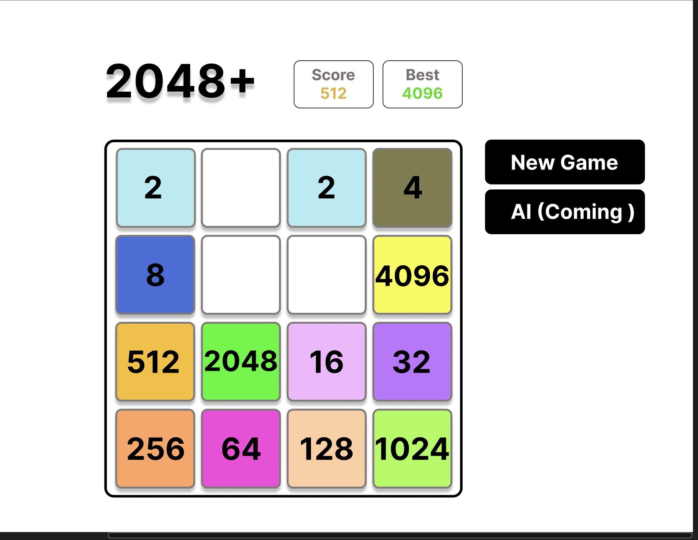

# 2048+ Created By Ryan Su

- [@Click Here To Play 2048+](https://ryansu1130.github.io/2048/)

Thank you for stopping by.

This is my attempt to re-create the classic game 2048 using the react framework.

The game is 100% fully functional so feel free to have a try at it.

I am currently working on a better UI and animation. Come back soon to check out the new updates.

The main technologies used are the following:
- [@Vitejs](https://vitejs.dev/)
- [@React](https://vitejs.dev/)

This is my Figma Design

